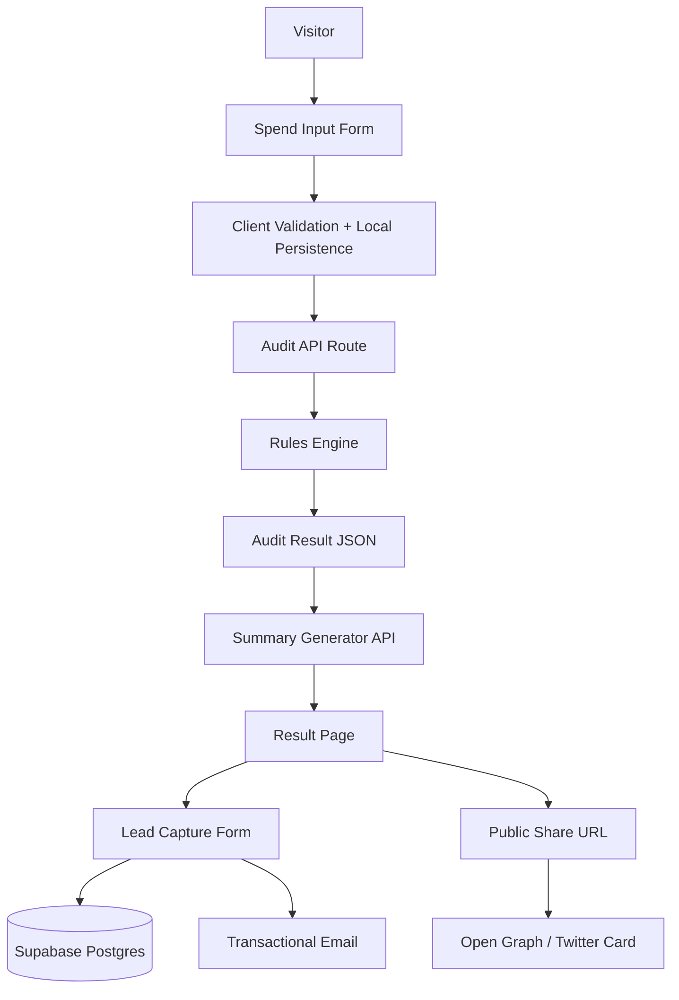

# Architecture

## Data Flow
1. User enters tools, plans, spend, seats, team size, and use case.
2. Form state is persisted in browser storage.
3. Submission hits a server route running deterministic pricing + recommendation rules.
4. Result object includes per-tool recommendations, reasons, and monthly/annual savings.
5. Summary endpoint calls an LLM for ~100-word personalized narrative with fallback on failure.
6. Lead capture writes audit-linked lead row to Supabase and sends confirmation email.
7. Public share page renders sanitized audit data with OG metadata.

## Stack Rationale
- Next.js gives route handlers + SSR pages + metadata APIs in one framework.
- TypeScript improves reliability for pricing and rules logic.
- Supabase provides quick, production-grade Postgres with low setup overhead.
- Resend keeps transactional email setup simple and reliable.

## Scaling to 10k Audits/Day
- Cache pricing tables server-side and version them.
- Move heavy summary generation to async queue with retry/backoff.
- Add CDN caching for public share pages and OG assets.
- Add per-IP + per-email rate limits at edge.
- Introduce analytics/event pipeline for conversion funnel visibility.